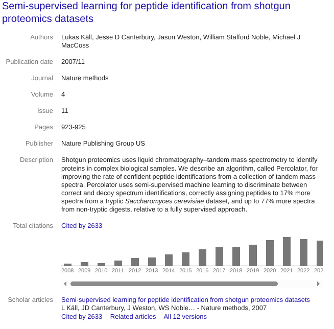

<!-- _class: title -->
# Open-Source & FAIR Research Software  
### A Proteomics Perspective

Lukas Käll &mdash; DDLS Research School Director for the Postdoc Program
250904

Based on:  
Perez-Riverol et al.  
*Journal of Proteome Research*, 2025  

---

# Why FAIR Software?

- Modern science depends on **computational tools**.  
- Scientific knowledge should be:
  - **Findable**  
  - **Accessible**  
  - **Interoperable**  
  - **Reusable**  

---

- FAIR principles apply not just to **data**, but also to **software**.  
> FAIR software is key to reproducibility, trust, and scientific progress.

# Why FAIR Software Matters for All Science

- Ensures **reproducibility** across disciplines.  
- Supports **collaborative science** by allowing integration of diverse tools.  
- Encourages **transparency** in algorithms and implementations.  
- Lowers **barriers to entry**, enabling broader participation.  
- Aligns with open science and funding mandates.  

---

# Proteomics and Software

- Mass spectrometry-based proteomics is **data-intensive**.  
- Analysis pipelines involve multiple steps:  
  - Spectral processing  
  - Identification  
  - Quantification  
  - Statistics & interpretation  
- Software is **central to discovery** in proteomics.  

---

# Benefits of Open & FAIR Software

- ✅ Transparency → Methods can be inspected and verified  
- ✅ Reproducibility → Same data → same results  
- ✅ Interoperability → Easier integration across tools  
- ✅ Sustainability → Community maintenance, no vendor lock-in  
- ✅ Innovation → Lowers barriers for new methods  

---

---

---

# Challenges in Proteomics Software

- Growing **complexity of mass spectrometry data**.  
- **Closed-source tools** lead to:  
  - Low reproducibility  
  - Difficult integration  
  - Hidden costs and inefficiencies  
- Platform-specific software fragments the community.  

---

# Open Source + FAIR Principles

- **Open-Source Software (OSS):**
  - Code is transparent and auditable  
  - Community-driven improvements  
- **FAIR Principles:**  
  - Standardized metadata, documentation, accessibility  
- Together, they ensure **trustworthy and sustainable tools**.

---

# Faking Openness

- Some tools appear *open* but are not truly OSS:  
  - Source code is hidden or incomplete  
  - Restrictive or unclear licenses  
  - Limited reusability or interoperability  
- Risks:  
  - Confuses users and funders  
  - Undermines trust in open science  
  - Blocks community-driven improvement  

> True openness requires **clear, OSI-approved licenses** and full transparency.

---

# Strategies to Commercialize OSS

- OSS and business are **not mutually exclusive**.  
- Models highlighted in the paper:  
  - **Dual licensing** (OSS + commercial license)  
  - **Support & services** (training, maintenance, customization)  
  - **Cloud offerings** (SaaS built on OSS tools)  
  - **Consortia & partnerships** for sustainability  
- Benefits:  
  - Ensures long-term support  
  - Aligns incentives between developers and users  
  - Strengthens the OSS ecosystem in proteomics

---

# Vision for the Future

- FAIR-aligned OSS as the **default standard**.  
- Stronger **community ecosystems** around key tools.  
- **Funding and recognition** for software development.  
- Greater **cross-disciplinary exchange** via interoperable tools.  
- A transparent and collaborative **research software culture**.

---

# Take-Home Messages

- Research software is as critical as data → must be FAIR.  
- Proprietary, siloed tools limit progress and reproducibility.  
- **Open-source + FAIR principles** provide the solution.  
- Proteomics shows both the challenges and the path forward.  
- The future of science is **open, reproducible, and FAIR**.  

